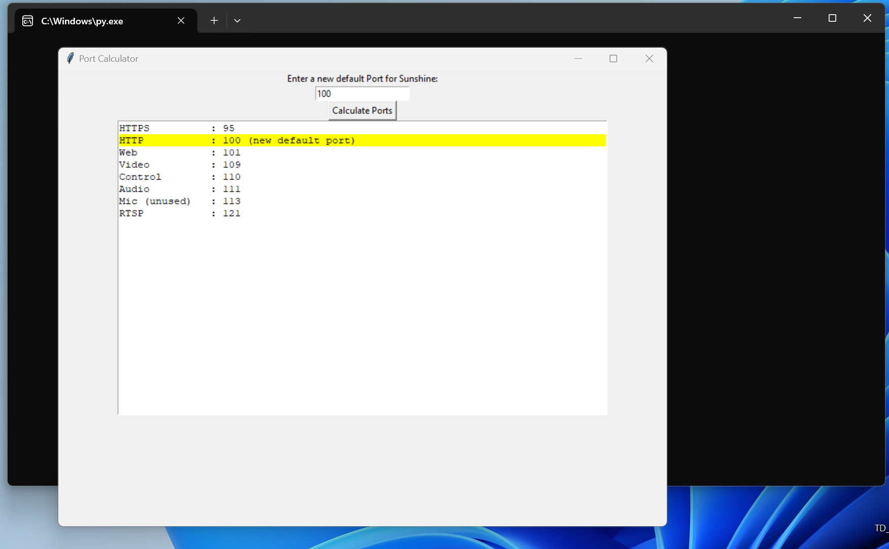

## Sunshine Calc: Your Port Calculation Companion 🌞🔢🚀

Sunshine Calc is a user-friendly GUI tool built with Python and tkinter. It calculates all the ports that need to be forwarded to successfully stream with Moonlight/Sunshine cloud streaming applications.

### Use Cases 💼

If you plan to use Sunshine or Moonlight as a streaming tool When deploying a server on platforms like **[Tensordock](https://tensordock.com)**, you need to forward multiple ports to your host node. Manually calculating each port can be time-consuming and prone to errors. 

Sunshine Calc automates this process, providing you with the correct port numbers for Streaming with Sunshine / Moonlight quickly and accurately.

### How to use it 🚀

1. Run the script. A window titled "Port Calculator" will appear.
2. Enter a new default port number in the entry field.
3. Click the **Calculate Ports** button.
4. All Ports that need to be forwarded will be displayed in the text widget. The new default port (HTTP) will be highlighted in yellow.

Please note that you need to enter an integer in the entry field. If you enter a non-integer value, an error message box will pop up. 🚫

By automating the port calculation process, Sunshine Calc helps you set up your gameserver applications more efficiently, reducing the margin for error and saving you valuable time.  👏
